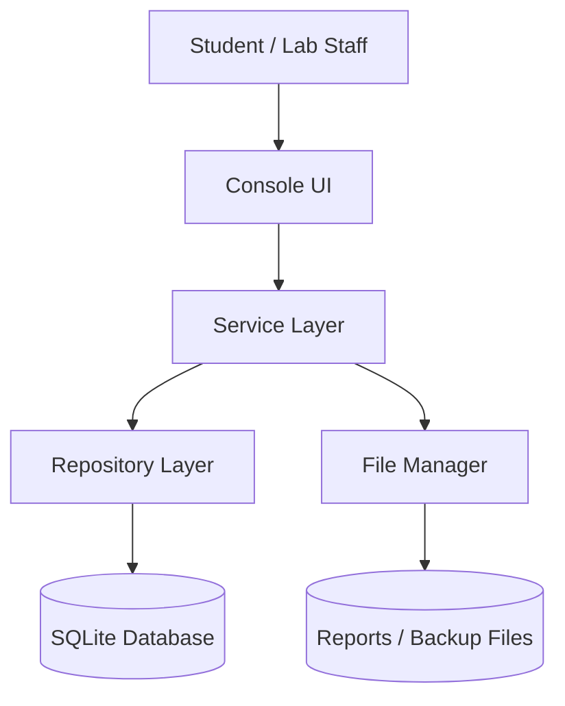
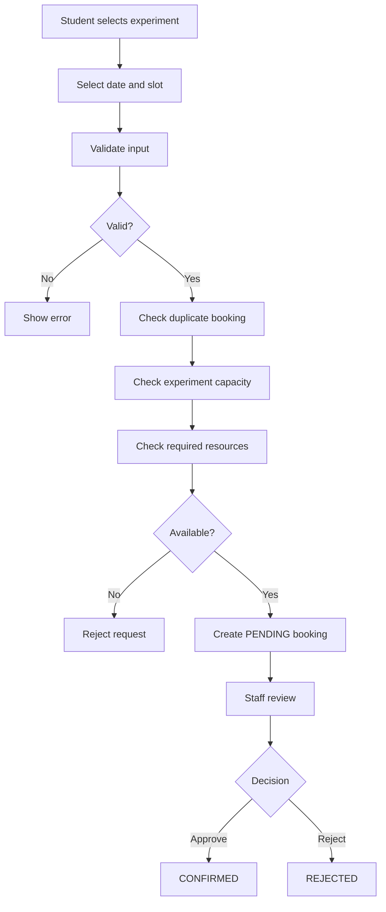

# CampusLab Design Notes

## Architecture



## Booking Workflow



## Main OOP Model

```text
LabResource (abstract)
├── Equipment
└── ComputerResource

User (abstract)
├── Student
└── LabStaff
```

The resource hierarchy demonstrates abstraction, inheritance and runtime polymorphism. The `Reservable` interface represents a capability rather than a family relationship.
